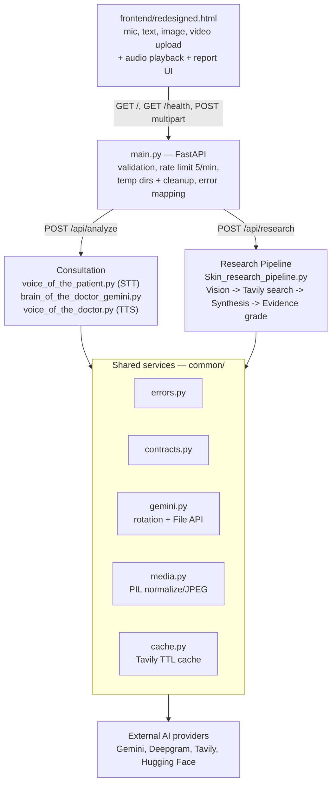
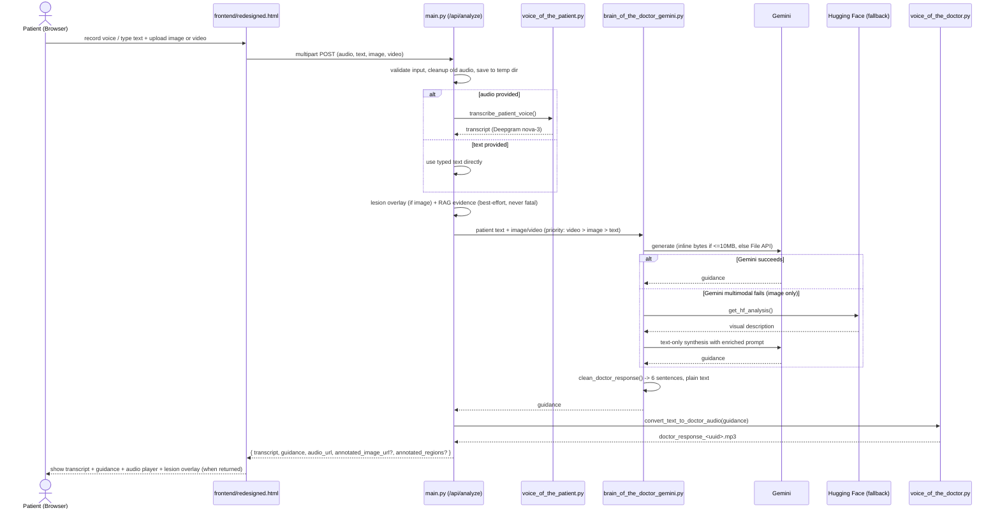
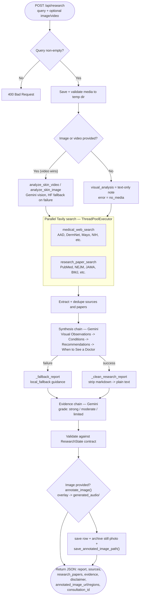
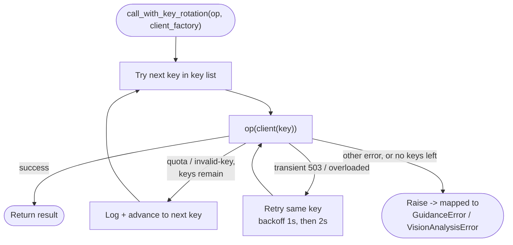
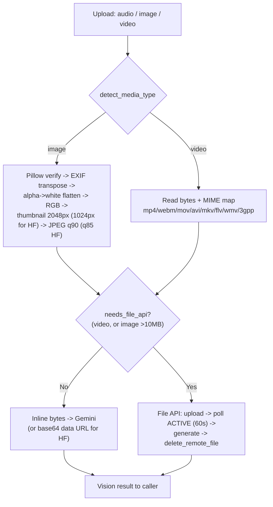

# DermOmni

DermOmni is a multimodal AI consultation and research assistant for general skin-care information. It combines patient voice, typed text, skin images, and skin videos into experiences served by a FastAPI backend and a single browser frontend (`frontend/redesigned.html`):

1. **Instant Consultation** — empathetic, spoken + written skin-care guidance.
2. **Evidence-Based Research** — structured 4-section report with medical sources, research papers, and evidence grading.
3. **Lesion Overlay Annotation** — Gemini bounding-box detection + Pillow callouts (green = mild, amber = moderate, red = severe) shown in the UI, stored per session, and embedded in the PDF.
4. **Consultation History** — secure per-user storage and retrieval of past sessions (text outputs + the uploaded still photo + the overlay image; audio/video bytes are never stored).
5. **PDF Report Export** — clinician-ready PDF rendering of any stored session via ReportLab.
6. **Feedback Loop & Eval Store** — thumbs up/down + notes with run metadata, exportable as JSONL for a future automated eval harness.
7. **Research Memory (Vector-DB Fallback)** — successful research reports are chunked into a per-user persistent vector store (ChromaDB, JSONL + TF-IDF fallback); when live web/paper search is down, the synthesis LLM backfills from the same user's cached research instead of failing.

> Important: this project provides general informational guidance only. It is not a medical diagnosis and does not replace care from a licensed dermatologist or clinician.

## Table of Contents

- [Project Overview](#project-overview)
  - [What This Project Does](#what-this-project-does)
  - [Key Capabilities](#key-capabilities)
  - [Tech Stack in Use](#tech-stack-in-use)
- [Architecture Overview](#architecture-overview)
  - [System Diagram](#system-diagram)
  - [Module Map](#module-map)
- [Full Workflow](#full-workflow)
  - [A. Instant Consultation Workflow](#a-instant-consultation-workflow--post-apianalyze)
  - [B. Advanced Research Workflow](#b-advanced-research-workflow--post-apiresearch)
  - [C. Cross-Cutting Flows](#c-cross-cutting-flows)
- [API Overview](#api-overview)
- [Consultation History, PDF Export & Feedback Loop](#consultation-history-pdf-export--feedback-loop)
- [Folder Structure](#folder-structure)
- [Installation](#installation)
- [Medical Disclaimer](#medical-disclaimer)

## Project Overview

### What This Project Does

- Accepts **voice + text + image + video** in any combination (at least one input required).
- Transcribes patient voice to text for analysis and display.
- Analyzes skin **images and videos** with Gemini multimodal vision, including temporal patterns in video.
- Generates concise, patient-friendly guidance plus a spoken doctor voice reply.
- Runs a deeper **research pipeline** that combines visual analysis with live medical web search and peer-reviewed paper search.
- Grades evidence quality (`strong / moderate / limited`) and attributes every source.
- Degrades gracefully with local fallbacks when AI providers fail, quota is exhausted, or no media is provided.
- Validates uploads, rate-limits consultation requests, and auto-cleans old audio files.
- Persists every successful consult/research run to a per-user history store, renders PDFs on demand, and logs feedback for evals.

### Key Capabilities

- **Multimodal consultation:** text-only, image-only, video-only, voice-only, or combined.
- **Video understanding:** color/texture changes over time, movement, progression/regression, dynamic features. Video takes precedence when both image and video are supplied.
- **Voice in / voice out:** speech-to-text for patient input, text-to-speech for doctor reply.
- **Research synthesis:** visual observations + Tavily medical search + Tavily paper search → 4-section plain-text report.
- **Evidence grading:** JSON evidence object with level, reason, source count, peer-review flag, and confidence note.
- **Resilience:** Gemini multi-key rotation, transient-error retries, Hugging Face image fallback, File API for large media, local fallback report.
- **Safety:** no diagnosis, no prescription, plain-text speech-safe outputs, medical disclaimer on every research response.
- **Lesion overlay annotation:** Gemini Vision bounding-box detection (`common/image_annotator.py`, model `GEMINI_CONSULT_MODEL` / `gemini-3.6-flash`) + Pillow rendering; unique `generated_audio/annotated_<uuid>.png` per request, served at `/audio/`; returned as `annotated_image_url` (web UI) + `annotated_image_path` (PDF engine) + `annotated_regions` on both `/api/analyze` and `/api/research`.
- **Consultation history:** SQLite (WAL) store keyed by opaque `user_id`; text outputs + one normalized still photo per session (`consultation_media/<id>.jpg`, 1024px JPEG) + overlay path (`annotated_image_path` → public `annotated_image_url`); newest-first listing with previews; owner-scoped read/delete (delete also removes the photo and the overlay file).
- **PDF export:** ReportLab renderer (`common/pdf_report.py`) — emerald healthcare palette, running header/footer with page numbers, meta table, disclaimer callout, side-by-side visual comparison card (original patient photo vs AI lesion overlay with severity legend), sectioned report, numbered sources, evidence box.
- **Feedback loop:** `POST /api/feedback` (up/down + ≤2000-char note) auto-attaches run metadata; `GET /api/evals/export` dumps JSONL for offline evals.
- **Research memory:** per-user vector store (`common/research_memory.py`) — provider-synthesised reports chunked (~600 chars, 300/user cap) into persistent ChromaDB (`data/research_memory/`), JSONL + TF-IDF fallback when Chroma is unavailable; reads filtered by `user_id` (`"anonymous"` excluded); dead live search → `PRIOR RESEARCH (CACHED)` backfill into the synthesis prompt, dead synthesis → `RELATED PRIOR FINDINGS` appended to the local fallback report.

### Tech Stack in Use

- **Backend:** FastAPI + Uvicorn (`main.py`)
- **Consultation brain:** Google Gemini (`brain_of_the_doctor_gemini.py`, default `gemini-3.6-flash`)
- **Research brain:** Gemini synthesis + evidence chains (`Skin_research_agents.py`)
- **Speech-to-text:** Deepgram `nova-3` (`voice_of_the_patient.py`)
- **Text-to-speech:** Deepgram `aura-2-thalia-en` (`voice_of_the_doctor.py`)
- **Medical search:** Tavily advanced search — trusted dermatology domains + journal domains (`Skin_research_tools.py`)
- **Orchestration:** LangChain Core `@tool` definitions for search/scrape/vision
- **Vision fallback:** Hugging Face Inference Providers, `Qwen/Qwen2.5-VL-3B-Instruct` (`huggingface_vision.py`, images only)
- **Frontend:** Single-page `frontend/redesigned.html` (Tailwind, mic recording via `MediaRecorder`, image/video upload, audio playback, lesion-overlay display in consult + research + history chat, history chatbot, PDF links)
- **Research memory store:** ChromaDB persistent collection (`chromadb>=0.5.0`) with JSONL + TF-IDF fallback (`common/research_memory.py`)
- **Shared core:** `common/` — typed errors, Pydantic contracts, Gemini key rotation + File API, media normalization, lesion annotator, history store, PDF renderer
- **Validation/storage:** Pillow image validation, temp-dir request isolation, `generated_audio/` served at `/audio/` (doctor MP3s + `annotated_<uuid>.png` overlays), SQLite history at `data/consultations.db` (`HISTORY_DB_PATH` override)
- **PDF export:** ReportLab (`reportlab>=4.0.0`) — pure `build_consultation_pdf(record) -> bytes`, no temp files

## Architecture Overview

```text
                    +----------------------+
                    | frontend/redesigned.html |
                    | mic / text / image / |
                    | video upload + audio |
                    | playback + report UI |
                    +----------+-----------+
                               |
                 GET /  GET /health  POST multipart
                               |
                    +----------v-----------+
                    | main.py (FastAPI)    |
                    | - validation         |
                    | - rate limit 5/min   |
                    | - temp dirs + cleanup|
                    | - error mapping      |
                    +--+---------------+---+
                       |               |
        /api/analyze (consult)   /api/research (research)
                       |               |
        +--------------v--+   +--------v------------------------+
        | Consultation    |   | Research Pipeline               |
        | voice_of_the_   |   | Skin_research_pipeline.py       |
        | patient.py (STT)|   |  1. Vision (image/video)        |
        | brain_of_the_   |   |  2. Tavily web + paper search   |
        | doctor_gemini   |   |     (parallel ThreadPool)       |
        | voice_of_the_   |   |  3. Synthesis chain (4 sections)|
        | doctor.py (TTS) |   |  4. Evidence chain (JSON grade) |
        +--------------+--+   +--------+------------------------+
                       |               |
        +--------------v---------------v--+
        | Shared services (common/)       |
        | errors.py / contracts.py        |
        | gemini.py (rotation + File API) |
        | media.py (PIL normalize/JPEG)   |
        | cache.py (Tavily TTL cache)     |
        +--------------+------------------+
                       |
        +--------------v------------------+
        | External AI providers           |
        | Gemini | Deepgram | Tavily | HF |
        +----------------+----------------+
```

### System Diagram

The same architecture, as a renderable flowchart:



### Module Map

| File | Role |
|------|------|
| `main.py` | HTTP layer. Serves frontend, exposes `GET /`, `GET /health`, `POST /api/analyze`, `POST /api/analyze-stream` (SSE preview, same limits), `POST /api/research`, `POST /api/chat`, history/PDF/feedback/eval endpoints. Handles upload validation, size/type limits, temp files, audio retention, rate limiting, CORS, and error-to-status mapping. |
| `brain_of_the_doctor_gemini.py` | Consultation intelligence. Builds prompt, calls Gemini text-only or multimodal, cleans output to 6 sentences / 2200 chars plain text, handles HF fallback + text-only degrade. |
| `voice_of_the_patient.py` | Deepgram STT. Reads audio bytes, retries on 429/5xx + transport errors, returns transcript or typed `TranscriptionError`. |
| `voice_of_the_doctor.py` | Deepgram TTS. Truncates to 2000 chars at sentence boundary, synthesizes MP3, saves to `generated_audio/doctor_response_<uuid>.mp3`. |
| `Skin_research_pipeline.py` | Research orchestrator. 4-step pipeline (vision → parallel searches → synthesis → evidence grading), validates output against `ResearchState` contract, supplies local fallback report. |
| `Skin_research_agents.py` | Two LLM chains: `_SynthesisChain` (query + visual + research → 4-section report) and `_EvidenceChain` (report + sources → evidence JSON). Includes markdown-stripping and token-limit handling. |
| `Skin_research_tools.py` | LangChain tools: `analyze_skin_image`, `analyze_skin_video`, `medical_web_search`, `research_paper_search`. Includes Tavily retry/backoff + TTL cache, Gemini vision routing (inline vs File API), HF fallback. |
| `huggingface_vision.py` | Free image fallback via HF chat-completion vision. Resizes to 1024px / JPEG 85, sends base64 data URL. Video explicitly unsupported (`video_not_supported`). |
| `common/errors.py` | Typed errors: `VisionAnalysisError`, `SearchError`, `ConfigurationError`, `TranscriptionError`, `SpeechSynthesisError`, `GuidanceError`. Each carries a machine `code` used for status mapping. |
| `common/contracts.py` | Pydantic contracts: `Source`, `Evidence`, `ResearchState`. Guarantees research API shape. |
| `common/gemini.py` | Multi-key rotation (`GEMINI_API_KEY` + `GEMINI_API_KEYS`), quota/invalid-key detection, transient 503 retry, File API upload/poll/delete, 10 MB inline threshold. |
| `common/media.py` | Single media truth: `detect_media_type`, EXIF-correct + alpha-flatten + JPEG encode, `prepare_vision_media`, `encode_image_to_data_url` for HF. |
| `common/cache.py` | TTL cache for Tavily searches (default 300 s, 256 entries). |
| `common/image_annotator.py` | Lesion overlay. `detect_skin_lesion_regions()` (Gemini JSON `box_2d` on 0–1000 scale, heuristic fallback) + `annotate_image()` (Pillow translucent fill + severity colors + label headers). Absolute output dir (`generated_audio/`), unique `annotated_<uuid>.png` per call, returns `{annotated_image_url (/audio/…), file_path, regions}`. |
| `common/history_store.py` | History + feedback store. Stdlib `sqlite3` (WAL, thread-locked), `init_db()` (+ `media_image_path` / `annotated_image_path` migrations), `save/list/get/delete_consultation()`, `archive_consultation_image()` / `save_annotated_image_path()` / `annotated_url_for_path()` / `get_media_dir()`, `save/list_feedback()`, `export_eval_jsonl()`. Resolves path via `HISTORY_DB_PATH` or `data/consultations.db`. |
| `common/research_memory.py` | Per-user research memory. `ResearchMemory` (persistent ChromaDB `research_memory` collection at `data/research_memory/`, JSONL + TF-IDF fallback via `FallbackVectorEngine`), `save_research_memory()` (provider reports only, ~600-char chunks, 300/user cap, `"anonymous"` excluded, never raises), `query_research_memory()` (always `user_id`-filtered). Env: `RESEARCH_MEMORY_PATH`, `RESEARCH_MEMORY_BACKEND` (`auto`/`chroma`/`jsonl`). |
| `common/pdf_report.py` | PDF renderer. Pure `build_consultation_pdf(record) -> bytes` + `parse_report_sections()`; ReportLab Platypus layout (emerald healthcare palette, running header/footer, meta table, disclaimer callout, side-by-side visual comparison card of original photo vs AI lesion overlay, sections, sources, evidence box). Missing/corrupt images degrade gracefully. |
| `frontend/redesigned.html` | Clinical UI: header, step rail (Describe → Visuals → Review), mic dial + waveform, preview, scan-sweep analysis state, guidance + audio player, lesion-overlay figure (consult + research + history thread), research report + sources + evidence badge, history chatbot, PDF links. |
| `generated_audio/` | Runtime output. Per-request MP3s (cleaned after 1 hour) + per-request `annotated_<uuid>.png` overlays (kept until the parent session is deleted). Served at `/audio/`. |
| `data/consultations.db` | Runtime output. SQLite history/feedback DB (WAL). Created on startup; override with `HISTORY_DB_PATH`. Stores text + one normalized still photo + overlay path per session; never stores audio/video bytes. |
| `data/consultation_media/` | Runtime output. Archived normalized still photos (`<consultation_id>.jpg`) embedded in PDF exports. Deleted with the parent session (overlay PNG in `generated_audio/` is deleted too). |
| `tests/` | Endpoint, Gemini rotation, media, and history/feedback/PDF tests (`test_history_feedback_pdf.py`). |

## Full Workflow

### A. Instant Consultation Workflow — `POST /api/analyze`

This is the default patient-facing flow: voice/text + visual → transcript + guidance + spoken reply.

**Visual flow:**



**Detailed trace:**

```text
User (browser)
  |-- records voice (MediaRecorder) and/or types text
  |-- uploads image and/or video
  v
Frontend packs multipart/form-data: audio?, text?, image?, video?
  v
main.py :: analyze()
  1. Require >=1 of audio/text/image/video else 400
  2. _cleanup_old_audio() — delete doctor_response_*.mp3 older than 1h
  3. Save each upload to temp dir skin-specialist-*
     - audio: allowed .wav/.mp3/.m4a/.mp4/.webm/.ogg/.flac, max 25 MB
     - image: allowed .jpg/.jpeg/.png/.webp/.gif/.jfif, max 10 MB
     - video: allowed .mp4/.webm/.mov/.avi/.mkv/.flv/.wmv/.3gpp, max 50 MB
     - suffix fallback via content-type map; mismatch → 415
     - oversize → 413
  4. Validate: Pillow decode + 10k px limit (image), extension+size (video)
  v
_run_analysis(audio_path, image_path, video_path, text)
  |
  +-- Step 1: Get patient words
  |     if audio: transcribe_patient_voice() → Deepgram nova-3
  |       - empty → TranscriptionError(no_speech) → 502
  |     elif text: use typed text directly
  |     else: transcript = "" (pure image-only allowed)
  |
  +-- Step 2: Build brain input
  |     brain_input = transcript or "No written description provided..."
  |     reject if >12000 chars → 400
  |
  +-- Step 2b: Lesion overlay + RAG evidence (best-effort, never fatal)
  |     if image: annotate_image() → generated_audio/annotated_<uuid>.png
  |       (Gemini boxes + Pillow callouts; failures only log a warning)
  |     RAG: get_dermatology_rag().query(brain_input, top_k=3) → rag_sources
  |
  +-- Step 3: brain_of_the_doctor(patient_text, image, video)
  |     priority: video > image > text-only
  |     prompt = "Patient description: ..." + media note
  |     |
  |     |-- Text-only: Gemini generate (LOW thinking, 1536 tokens,
  |     |              temp 0.8, text/plain) with key rotation
  |     |
  |     |-- Small image (<=10 MB): inline bytes path
  |     |     prepare_vision_media() → EXIF-fix, RGB, thumbnail 2048px,
  |     |     JPEG q90 → Part.from_bytes + prompt → Gemini
  |     |
  |     |-- Video or file >10 MB: File API path
  |     |     upload_file_and_wait() → poll ACTIVE (60 s) →
  |     |     generate with file ref → delete_remote_file()
  |     |
  |     |-- On Gemini multimodal failure:
  |           HF fallback (images only): get_hf_analysis() → visual
  |           description → Gemini text-only synthesis with enriched prompt
  |           Video failure: retry Gemini text-only with "video unavailable" note
  |           Else: GuidanceError → 502 (429 if quota_exhausted)
  |     |
  |     +-- clean_doctor_response(): strip thinking tags, markdown,
  |         bullets, collapse whitespace, cap 6 sentences / 2200 chars,
  |         ensure terminal punctuation, plain text for TTS
  |
  +-- Step 4: convert_text_to_doctor_audio(guidance)
        Deepgram aura-2-thalia-en → MP3 bytes → generated_audio/
        doctor_response_<uuid>.mp3 (empty → tts_empty_response → 502)
  v
Return JSON: { transcript, guidance, audio_url: "/audio/....mp3",
  language, rag_sources, annotated_image_url?, annotated_regions? }
  v
_save_consultation_record(): save row + archive still photo +
save_annotated_image_path() → response += {consultation_id, annotated_image_path?}
(persist wrapped in try/except → warning log only; clinical result unaffected)
  v
Frontend displays transcript + guidance text + audio player (auto-cleaned server-side)
+ lesion overlay image (when returned)
Temp request dir deleted (shutil.rmtree)
```

**Rate limit:** 5/minute per IP on `/api/analyze` (SlowAPI). Exceed → `429 {"detail": "Rate limit exceeded (5/min)..."}`.

**Error mapping (consult):**

| Condition | HTTP |
|-----------|------|
| No input supplied | 400 |
| Undecodable image / wrong media type | 400 |
| Transcription empty / STT failure | 502 |
| TTS failure / empty audio | 502 |
| Guidance empty / provider failure | 502 (429 when quota exhausted) |
| Missing server key config | 500 |

### B. Advanced Research Workflow — `POST /api/research`

This is the evidence-based flow: query + optional visual → visual analysis + web sources + papers + 4-section report + evidence grade.

**Visual flow:**



**Detailed trace:**

```text
User (browser / API client)
  |-- enters text query (required) + optional image or video
  v
Frontend packs multipart/form-data: query, image?, video?
  v
main.py :: research()
  1. Require non-empty query else 400
  2. _cleanup_old_audio()
  3. Save image/video to temp dir skin-research-* (same type/size rules as above)
  4. Validate image/video
  v
run_skin_research_pipeline(query, image_path, video_path)
  |
  +-- Step 1: Visual skin media analysis
  |     media = video or image (video wins)
  |     if media: analyze_skin_video() or analyze_skin_image()
  |       - image prompt → VISUAL CHARACTERISTICS + 3 CONDITION CANDIDATES
  |       - video prompt → VISUAL CHARACTERISTICS OVER TIME + DYNAMIC
  |         FEATURES + 3 CONDITION CANDIDATES
  |       - small → inline bytes; video/large → File API; quota/invalid-key
  |         → rotate keys; all-Gemini fail → HF fallback (image only)
  |       - failure → continue text-only with diagnostic status, e.g.
  |         "Video analysis could not be completed... Diagnostic status: ..."
  |     else: visual_analysis = "No image or video was provided... Patient
  |           description: <query>", error = "no_media"
  |
  +-- Step 2: Medical web search + paper search (parallel)
  |     visual_excerpt = visual_analysis[:250]
  |     search_query = "skin condition <query> symptoms diagnosis treatment
  |                     dermatology <excerpt>"
  |     paper_query  = "<query> dermatology skin condition clinical study"
  |     ThreadPoolExecutor(2):
  |       medical_web_search → Tavily advanced, 6 results, domains:
  |         ncbi, aad.org, dermnetnz, mayoclinic, healthline, webmd,
  |         nih.gov, clevelandclinic
  |       research_paper_search → Tavily advanced, 5 results, domains:
  |         pubmed, ncbi, jamanetwork, nejm, springer, sciencedirect, bmj
  |     Each: TTL-cache lookup → client.search(timeout 15 s, retries 2,
  |           backoff 0.5 s×2^attempt on 429/5xx/timeout) → format as
  |           "Title/Paper: ... URL: ... Snippet/Abstract: ..." blocks
  |     _extract_sources(): parse blocks, validate URL (Pydantic Source),
  |     dedupe by URL preserving order → sources[] + research_papers[]
  |     combined_research = "MEDICAL SOURCES: ... RESEARCH PAPERS: ..." [:7000]
  |
  +-- Step 2b: Vector-DB memory backfill (only when BOTH live searches came
  |     back empty AND a non-anonymous user_id was passed)
  |     query_research_memory(user_id, query + visual_excerpt, top_k=3)
  |       → "PRIOR RESEARCH (CACHED — same user, may be dated)" block
  |     prepended to combined_research, so the synthesis LLM still gets
  |     evidence from the user's own past provider reports.
  |
  +-- Step 3: Synthesizing report (Skin_research_agents.synthesis_chain)
  |     input: { query, visual_analysis, research_data }
  |     Gemini (MEDIUM thinking, 3000 tokens, temp 0.7, text/plain):
  |       VISUAL OBSERVATIONS — 2-3 sentences
  |       POTENTIAL CONDITIONS — top 2-3, 2 sentences each (what + why)
  |       RECOMMENDATIONS — 4 actionable home-care steps (ingredients,
  |         avoidances, lifestyle)
  |       WHEN TO SEE A DOCTOR — specific red flags (spreading redness,
  |         pain, fever, 2-week changes...)
  |     _clean_research_report(): strip markdown/bullets/symbols, normalize
  |     blank lines → plain patient-readable text
  |     On failure → _fallback_report() (safe generic guidance + original
  |     visual + query), marked report_generated_by="local_fallback".
  |     If memory backfill found cached chunks, top-2 are appended as
  |     "RELATED PRIOR FINDINGS (from your own past research, may be dated)".
  |
  +-- Step 4: Grading evidence quality (evidence_chain)
        input: { report, sources: JSON(all_sources) }
        Gemini (900 tokens) → strict JSON:
          { evidence_level: strong|moderate|limited,
            evidence_reason, source_count, has_peer_reviewed, confidence_note }
        Rating guide: strong = 2+ peer-reviewed papers; moderate =
        reputable sites (AAD/Mayo/DermNet/NIH) but <2 papers;
        limited = general web only or <3 sources total
        _safe_json_parse() tolerates fences/prose → _normalize_evidence()
        → fallback moderate/limited if grading fails
  v
Validate full state against ResearchState contract
  |
  +-- Step 5: Lesion overlay (image only, best-effort, never fatal)
  |     annotate_image() → generated_audio/annotated_<uuid>.png
  |     result += {annotated_image_url, annotated_regions}
  v
_save_consultation_record(): save row + archive still photo +
save_annotated_image_path() → response += {consultation_id, annotated_image_path?}
(persist wrapped in try/except → warning log only; clinical result unaffected)
  v
save_research_memory(): if report_generated_by == "provider", chunk the report
(~600 chars, tagged with user_id/query/evidence_level) into the persistent
vector DB for future fallbacks. Local fallbacks and "anonymous" sessions are
never ingested. Best-effort — ingest failure never fails the request.
  v
Return JSON:
{
  query, visual_analysis, report,
  sources: [{title, url}], research_papers: [{title, url}],
  evidence: { evidence_level, evidence_reason, source_count,
              has_peer_reviewed, confidence_note },
  disclaimer: "This report is generated by an AI research assistant...",
  annotated_image_url?, annotated_regions?, consultation_id
}
  v
Frontend renders overlay image (when returned) + report sections,
source links, paper links, evidence badge
Temp request dir deleted
```

**Error mapping (research):**

| Condition | HTTP |
|-----------|------|
| Empty query | 400 |
| Bad media (undecodable / wrong type) | 400 |
| Vision step hard failure | 502 (continues text-only for soft failures) |
| Tavily/search failure | 502 with TAVILY key hint |
| Missing server config | 500 |

### C. Cross-Cutting Flows

**Gemini key rotation (`common/gemini.py`):**

*Visual flow:*



*Detailed trace:*

```text
get_gemini_api_keys() → [GEMINI_API_KEY, ...GEMINI_API_KEYS split by ,/;/newline]
call_with_key_rotation(op, client_factory):
  for each key:
    try op(client(key)) → return on success
    on quota (429/RESOURCE_EXHAUSTED/quota/rate-limit) or invalid-key
    (400/401/403 + key markers) and keys remain → log + next key
    on transient 503/overloaded → retry same key with 1 s, 2 s backoff
    else raise immediately
  last error propagates → mapped to GuidanceError / VisionAnalysisError
```

**Media handling (`common/media.py`):**

*Visual flow:*



*Detailed trace:*

```text
detect_media_type(path) → "video" if suffix in VIDEO_EXTENSIONS else "image"
image: Pillow verify → EXIF transpose → alpha→white flatten → RGB →
       thumbnail (2048px consult/research, 1024px HF) → JPEG (q90 / q85 HF) →
       inline bytes (Gemini) or base64 data URL (HF)
video: read bytes + mime map (mp4/webm/mov/avi/mkv/flv/wmv/3gpp) → File API upload
needs_file_api(): True for all video, or image >10 MB (env-tunable)
```

**Search resilience (`Skin_research_tools.py`):**

```text
build cache key (op + query + depth + domains) → TTLCache hit? return : Tavily search
retry loop (attempts = RETRIES+1): on 429/500/502/503/504/rate-limit/timeout/
connection-reset → sleep backoff → retry; non-retryable → SearchError immediately
```

**Audio lifecycle (`main.py` + `voice_of_the_doctor.py`):**

```text
TTS text capped at 2000 chars (sentence-boundary cut) → Deepgram MP3 →
generated_audio/doctor_response_<uuid>.mp3 → served via StaticFiles /audio/ →
old files (>1 h) purged at start of each analyze/research request
```

## API Overview

Served at `http://127.0.0.1:8000` with frontend at `GET /`.

### `GET /health`

```json
{ "status": "ok" }
```

### `POST /api/analyze` — multipart form

Inputs: `audio` (file, optional), `text` (string, optional), `image` (file, optional), `video` (file, optional), `user_id` (string, optional; or `X-User-Id` header). At least one of audio/text/image/video required.

Success (note the additive `consultation_id` for history/PDF/feedback):

```json
{
  "transcript": "transcribed or typed patient words (empty for image-only)",
  "guidance": "6-sentence plain-text skin-care guidance",
  "audio_url": "/audio/doctor_response_<uuid>.mp3",
  "language": "en (from Accept-Language)",
  "rag_sources": [{ "title": "...", "content": "..." }],
  "annotated_image_url": "/audio/annotated_<uuid>.png (only when an image was uploaded)",
  "annotated_regions": [{ "label": "Primary Lesion", "severity": "moderate" }],
  "consultation_id": "<uuid-hex>"
}
```

`POST /api/analyze-stream` (SSE, same inputs/limits as `/api/analyze`) streams progressive events instead: `language_detected` → `stt_transcript` → `image_annotation` → `rag_evidence` → `guidance` → `audio_url` → `complete` (or `error`). Preview-only: it does not write history rows.

### `POST /api/research` — multipart form

Inputs: `query` (string, required), `image` (file, optional), `video` (file, optional), `user_id` (string, optional; or `X-User-Id` header).

Success:

```json
{
  "query": "patient question",
  "visual_analysis": "Gemini/HF visual findings or text-only notice",
  "report": "VISUAL OBSERVATIONS... POTENTIAL CONDITIONS... RECOMMENDATIONS... WHEN TO SEE A DOCTOR...",
  "sources": [{ "title": "...", "url": "https://..." }],
  "research_papers": [{ "title": "...", "url": "https://..." }],
  "evidence": {
    "evidence_level": "strong | moderate | limited",
    "evidence_reason": "...",
    "source_count": 0,
    "has_peer_reviewed": true,
    "confidence_note": "..."
  },
  "disclaimer": "This report is generated by an AI research assistant...",
  "annotated_image_url": "/audio/annotated_<uuid>.png (only when an image was uploaded)",
  "annotated_regions": [{ "label": "Primary Lesion", "severity": "moderate" }],
  "consultation_id": "<uuid-hex>"
}
```

Static media: `GET /audio/doctor_response_<uuid>.mp3`, `GET /audio/annotated_<uuid>.png`.

### History, PDF & feedback endpoints

All history endpoints scope by user. Resolve order: explicit `user_id` param/field → `X-User-Id` header → `"anonymous"`. Cross-user access returns `404` (no existence leak).

| Method & path | Purpose |
|---|---|
| `GET /api/history?user_id=&kind=&limit=20&offset=0` | Newest-first session summaries (`preview` ≤280 chars; `report`/`guidance` blanked for payload size). `kind` filters `consult`/`research`. |
| `GET /api/history/{id}?user_id=` | Full stored row (transcript/guidance/report/visual_analysis/evidence/sources/media_kind/media_image_path/annotated_image_path/annotated_image_url/latency_ms/model_meta). |
| `DELETE /api/history/{id}?user_id=` | Owner-scoped delete → `{deleted: true, consultation_id}` (also deletes the archived photo and overlay file). |
| `GET /api/history/{id}/export.pdf?user_id=` | Clinician PDF download (`application/pdf`, `skin-report-<shortid>.pdf`). |
| `POST /api/chat` | JSON `{message (≤2000 chars), consultation_id?, user_id?, history? (≤20 turns)}`; follow-up reply grounded in the stored session (10/min). Returns `{reply, consultation_id}`. `400` empty message; `404` unknown/foreign session. |
| `POST /api/feedback` | JSON `{consultation_id, rating, note?, user_id?}`; `rating` accepts `up/down` (also `1/-1`, `thumbs_up/down`). Returns stored row incl. auto-attached `run_metadata`. `201` on success; `400` bad rating; `404` unknown/foreign session. Backend eval API (no frontend widget). |
| `GET /api/feedback?consultation_id=&user_id=&limit=50&offset=0` | Review logged feedback. |
| `GET /api/evals/export?limit=1000` | JSONL dump (`application/jsonl`, `skin-evals.jsonl`) joining each feedback row with its parent run context. |

User identity is an opaque browser UUID (`localStorage:skin_user_id`); no passwords. Store failures degrade to `503`, and a persist failure never fails the clinical call itself (logged server-side).

## Consultation History, PDF Export & Feedback Loop

### User contexts

- No login. The frontend mints `crypto.randomUUID()` once, stores it as `localStorage:skin_user_id`, and sends it as the `user_id` form field plus the `X-User-Id` header on every call.
- Backend `main.py::_resolve_user_id()` prefers the explicit field, then the header, then `"anonymous"`; `common/history_store.sanitize_user_id()` strips to `[alnum -_: @ .]`, max 64 chars.
- Every history/feedback read, PDF export, and delete filters by `(id, user_id)` — a wrong user gets `404`, never another user's data.

### Database schema (`common/history_store.py`)

SQLite via stdlib only, WAL mode, module-level write lock (FastAPI runs pipelines in threadpools), short-lived connections. Path: `data/consultations.db`, override with `HISTORY_DB_PATH` (tests use a tmp DB).

```sql
consultations(
  id TEXT PRIMARY KEY,              -- uuid4 hex
  user_id TEXT NOT NULL,
  kind TEXT CHECK(kind IN ('consult','research')),
  created_at TEXT,                   -- UTC ISO-8601
  input_text TEXT, transcript TEXT,
  guidance TEXT,                     -- consult output
  report TEXT,                       -- research output
  visual_analysis TEXT, audio_url TEXT,
  evidence_json TEXT,                -- {evidence_level, reason, ...}
  sources_json TEXT,                 -- [{title, url}]
  media_kind TEXT,                   -- none | image | video | audio | mixed
  media_image_path TEXT,             -- absolute path consultation_media/<id>.jpg (still photo for PDF; "" if none)
  annotated_image_path TEXT,         -- absolute path generated_audio/annotated_<uuid>.png (overlay for UI + PDF; "" if none)
  latency_ms INTEGER,
  model_meta_json TEXT               -- {consult_model, stt_model, tts_model}
);
CREATE INDEX idx_consult_user_created ON consultations(user_id, created_at DESC);

feedback(
  id TEXT PRIMARY KEY,
  consultation_id TEXT REFERENCES consultations(id) ON DELETE CASCADE,
  user_id TEXT NOT NULL,
  rating TEXT CHECK(rating IN ('up','down')),
  note TEXT,                         -- ≤2000 chars
  run_metadata_json TEXT,            -- auto-attached eval context
  created_at TEXT
);
CREATE INDEX idx_feedback_consult ON feedback(consultation_id, created_at DESC);
```

Privacy invariant: text outputs + JSON metadata + one normalized still photo per session are stored (`consultation_media/<id>.jpg`, max 1024px, JPEG q82) plus the lesion-overlay PNG (`generated_audio/annotated_<uuid>.png`, served at `/audio/`). Audio/video bytes are never stored — uploads otherwise stay in per-request temp dirs and are deleted; `audio_url` may 404 after the 1-hour MP3 retention — the text and images remain. `DELETE /api/history/{id}` also deletes the archived photo and the overlay file.

### Persist flow

```text
POST /api/analyze|research (user_id)
  → run pipeline incl. annotate_image() on the uploaded still image
    (Gemini boxes → Pillow overlay → generated_audio/annotated_<uuid>.png)
  → history_store.save_consultation(user_id, kind, input_text/transcript,
      guidance/report, visual_analysis, evidence, sources, media_kind,
      latency_ms, model_meta {_model_meta()})
  → history_store.archive_consultation_image(id, <temp image_path>)
      (still image only, normalized to consultation_media/<id>.jpg;
       video-only / no-image sessions store "")
  → history_store.save_annotated_image_path(id, <overlay file_path>)
      (persists annotated_image_path + derived annotated_image_url;
       no-image sessions store "")
  → response += {consultation_id, annotated_image_url?, annotated_regions?}
  (persist + photo/overlay archive wrapped in try/except → warning log only;
   clinical result unaffected; archiving happens before the temp dir is deleted)
```

### PDF export (`common/pdf_report.py`)

Pure function `build_consultation_pdf(record: dict) -> bytes` (ReportLab Platypus, A4, no temp files):

1. Brand header + kind/date/short-ID subtitle.
2. Meta table (session kind, media, evidence level, source count).
3. Amber medical-disclaimer callout (every PDF).
4. **Uploaded photo** — the patient's still image for that session (from `media_image_path`, aspect-preserved ≤150×90 mm) with a provenance caption. Missing/corrupt photos are skipped so the PDF stays text-complete.
5. **Annotated analysis overlay** — the lesion-callout image for that session (from `annotated_image_path`, aspect-preserved ≤150×90 mm) with a severity legend (green = mild, amber = moderate, red = severe) and a visual-reference-only caption. Missing/corrupt overlays are skipped.
6. Patient description → visual analysis → `parse_report_sections()` output (`VISUAL OBSERVATIONS / POTENTIAL CONDITIONS / RECOMMENDATIONS / WHEN TO SEE A DOCTOR`, else `CLINICAL GUIDANCE`).
7. Numbered sources (title + muted URL, capped at 20) and evidence table.
8. Footer on every page: `DermOmni — informational only • Page N` + storage note.

```bash
curl -OJ "http://127.0.0.1:8000/api/history/<id>/export.pdf?user_id=<uuid>"
```

### Feedback loop & eval harness

```bash
curl -X POST http://127.0.0.1:8000/api/feedback \
  -H 'Content-Type: application/json' \
  -d '{"consultation_id":"<id>","rating":"up","note":"Clear guidance","user_id":"<uuid>"}'
# → 201 {id, consultation_id, user_id, rating, note, run_metadata, created_at}
```

`run_metadata` is server-derived from the parent row (`kind, media_kind, latency_ms, evidence_level, source_count, report_len, model_meta`) so evals can't be spoofed by the client. Export for offline training/eval:

```bash
curl -OJ "http://127.0.0.1:8000/api/evals/export?limit=1000"
# skin-evals.jsonl — one JSON object per line:
# {feedback_id, consultation_id, user_id, rating, note, created_at,
#  run_metadata, consultation:{kind, input_text, transcript, guidance,
#  report, visual_analysis, evidence, sources, media_kind, latency_ms, model_meta}}
```

### Error mapping (new endpoints)

| Condition | HTTP |
|---|---|
| Unknown/foreign `consultation_id` (read, PDF, delete, feedback) | 404 |
| Bad `rating` (not up/down/1/-1) | 400 |
| History DB I/O failure | 503 |
| PDF render failure | 502 |

## Folder Structure

```text
├── common
│   ├── cache.py
│   ├── contracts.py
│   ├── dermatology_rag.py
│   ├── env.py
│   ├── errors.py
│   ├── gemini.py
│   ├── history_store.py
│   ├── image_annotator.py
│   ├── localization.py
│   ├── media.py
│   ├── pdf_report.py
│   ├── research_memory.py
│   └── README.md
├── data
│   ├── consultation_media
│   │   ├── 5250efce83b04235a7e82e41147814e3.jpg
│   │   └── ca7673cd71e44e229bfda3193c639188.jpg
│   ├── dermatology_kb
│   ├── research_memory
│   └── consultations.db
├── frontend
│   └── redesigned.html
├── tests
│   ├── __init__.py
│   ├── conftest.py
│   ├── README.md
│   ├── test_chat.py
│   ├── test_dermatology_rag.py
│   ├── test_endpoints.py
│   ├── test_gemini_client.py
│   ├── test_history_feedback_pdf.py
│   ├── test_image_annotator.py
│   ├── test_localization.py
│   ├── test_media.py
│   ├── test_research_memory.py
│   └── test_sse.py
├── brain_of_the_doctor_gemini.py
├── huggingface_vision.py
├── main.py
├── pyproject.toml
├── README.md
├── Skin_research_agents.py
├── Skin_research_pipeline.py
├── Skin_research_tools.py
├── uv.lock
├── voice_of_the_doctor.py
└── voice_of_the_patient.py
```

## Installation

**Requirements:** Python 3.11+.

```bash
# 1. Clone and enter the project
git clone <repo-url>
cd ai-skin-specialist-main

# 2. Create and activate a virtual environment
python -m venv .venv
.\.venv\Scripts\activate        # Windows
# source .venv/bin/activate     # macOS / Linux

# 3. Install dependencies
pip install -e .
# or: uv sync

# 4. Add API keys to a local .env file (never commit this file)
#    Required: GEMINI_API_KEY, DEEPGRAM_API_KEY, TAVILY_API_KEY, HF_API_KEY
GEMINI_API_KEY=...
DEEPGRAM_API_KEY=...
TAVILY_API_KEY=...
HF_API_KEY=...
# Optional (research memory vector DB; defaults work without these):
# RESEARCH_MEMORY_PATH=data/research_memory
# RESEARCH_MEMORY_BACKEND=auto   # auto | chroma | jsonl

# 5. Start the server
python main.py
# Open http://127.0.0.1:8000

# 6. Run tests (optional)
python -m pytest tests/ -q
```

## Medical Disclaimer

This app is an AI assistant for general skin-care information. It cannot diagnose disease, prescribe medication, or replace a medical professional. For severe symptoms, rapid spreading, fever, pain, bleeding, infection signs, or urgent concerns, contact a licensed clinician immediately.